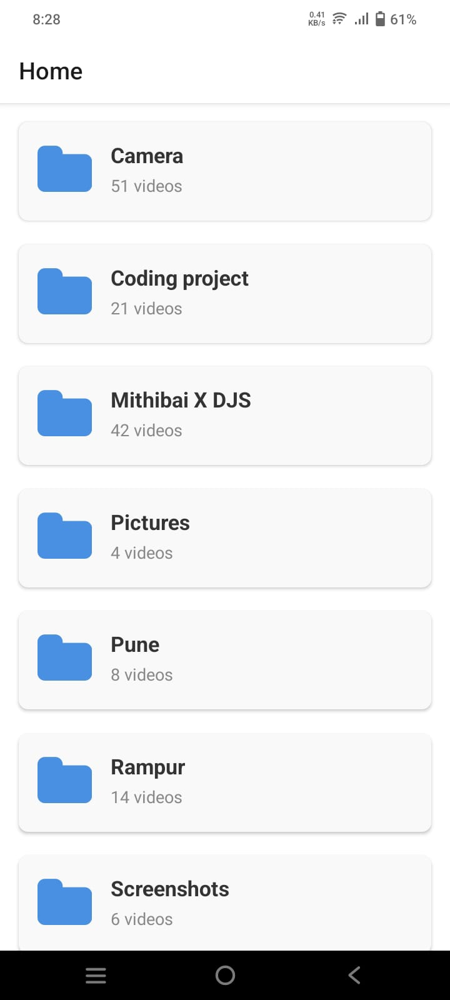
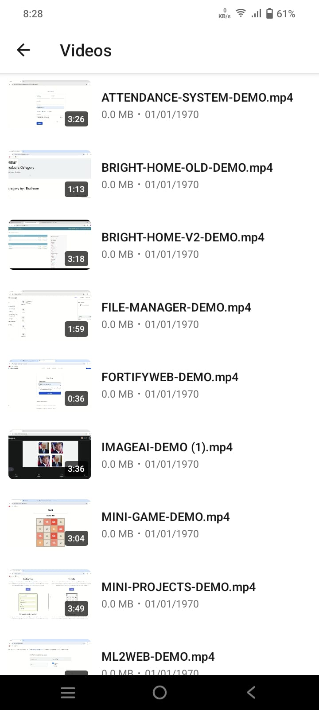

# 📺 Video Player App  

  <!-- Logo -->
  

  A simple, fast, and elegant video player built with ❤️.  

---

## ✨ Features
- ▶️ Smooth video playback with play/pause/seek controls  
- 🔊 Volume control & mute option  
- 📺 Fullscreen mode  
- 📂 Supports multiple formats (MP4, MKV, AVI, etc.)  
- 🎨 Minimal & responsive UI  

---

## 📸 Demo

  
  

---

## 🛠️ Tech Stack
- [React Native / Kotlin / Your Tech]  
- [Libraries used, # 📺 Video Player App  

  <!-- Logo -->
  

  A simple, fast, and elegant video player built with ❤️.  

---

## ✨ Features
- ▶️ Smooth video playback with play/pause/seek controls  
- 🔊 Volume control & mute option  
- 📺 Fullscreen mode  
- 📂 Supports multiple formats (MP4, MKV, AVI, etc.)  
- 🎨 Minimal & responsive UI  

---

## 📸 Demo

  
  

---

## 🛠️ Tech Stack
- React Native  
- Expo Video 

---

⭐ If you like this project, give it a star on GitHub!

